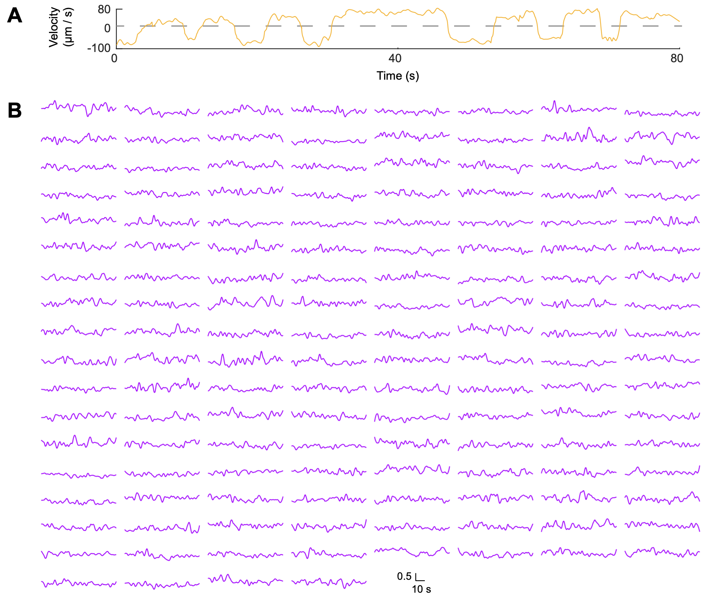

# CenDer

Processing pipeline, dataset, human annotation and proofreading toolkit for “[*Rapid detection and recognition of whole brain activity in a freely behaving Caenorhabditis elegans*](https://arxiv.org/abs/2109.10474)”

#### Top News

**`2022-01-22`**:  We have released our dataset, CenDer PyTorch implementation, human annotation and proofreading MATLAB toolkits.

#### Introduction

CenDer is a streamlined machine learning approach that rapidly detects and recognizes most head ganglion neurons and their calcium activity during animal movements. After learning from a small number of human-annotated examples, a GPU machine is able to process each imaging volume - 1024 x 1024 x18 in voxels - in less than *one second* and achieves an accuracy of 91% in neuronal detection and 80% in neuronal recognition. Our paper website: [https://arxiv.org/abs/2109.10474](https://arxiv.org/abs/2109.10474).

Language used: Python 3.7 (with PyTorch 1.90), MATLAB 2020.


#### Data and pretrained models preparation

Download *data* folder ([Google drive](https://drive.google.com/drive/folders/1jc1hJhYA_ASVtELY1EXx2aNN3ErO0DSW?usp=sharing)) 

Download *models* folder ([Google drive](https://drive.google.com/drive/folders/1f-_sYYnz8leT7RLVpOwjWFc1x6vReOmx?usp=sharing))

#### Pipeline inference

**Demo**

```shell
CUDA_LAUNCH_BLOCKING=1 CUDA_VISIBLE_DEVICES=0 python pipeline_infer.py --det-fp16 --volume-window 4 --load-preprocess-result-root data/traces_data/proofreading --process-stack-root data/traces_data/raw --det-model-load-path models/det_model.ckpt --rec-model-load-path models/rec_model.ckpt --json-store-root data/traces_result
```

The Calcium dynamics (GCaMP data will release soon) from an 80-second period of 140 neurons:



**Inference from scratch**

```shell
CUDA_LAUNCH_BLOCKING=1 CUDA_VISIBLE_DEVICES=0 python pipeline_infer.py --preprocessing-mode 3 --det-fp16 --process-stack-root data/traces_data/raw --det-model-load-path models/det_model.ckpt --rec-model-load-path models/rec_model.ckpt --json-store-root data/traces_result
```

**Segmentated inference**

To improve accuracy, one should tune pre-processing results (e.g., *C. elegans* coordinate system).

1. Pre-processing stage inference

```shell
python pipeline_infer.py --only-preprocessing --preprocessing-mode 6 --process-stack-root data/traces_data/raw --save-preprocess-result-root data/traces_data/raw_proofreading
```

2. Using [LABELME](https://github.com/wkentaro/labelme) (version 4.5.7) to tune

```shell
labelme data/traces_data/raw_proofreading
```

3. Pipeline inference from modified *C. elegans* coordinate system (*data/traces_data/proofreading* folder had been modified already):

```shell
CUDA_LAUNCH_BLOCKING=1 CUDA_VISIBLE_DEVICES=0 python pipeline_infer.py --det-fp16 --volume-window 4 --load-preprocess-result-root data/traces_data/proofreading --process-stack-root data/traces_data/raw --det-model-load-path models/det_model.ckpt --rec-model-load-path models/rec_model.ckpt --json-store-root data/traces_result
```

#### Human annotation and proofreading toolkit

Human annotation contains two main procedures: 

1. *Division*, convert raw tiff images into 3D image stacks

   ```matlab
   image_stack=import_micromanager_data_and_reshape;
   ```

   Read and divide tiff data according to your 3D imaging setup. The output should be a num_of_volumes × 1 *cell*. Each element of the *cell* is a volume, represented by a height × width × num_of_slices uint16 matrix. 

2. *Annotation*, draw and label bounding boxes manually; or proofread the inferred bounding boxes. This part runs in MATLAB. 

   - If you don't have bounding boxes :

     ```matlab
     whole_brain_imaging(image_stack)
     ```

     Show the image stack. To draw a bounding box by hand, select *Annotation->Bound neuron* in the menu bar, and then left-click to draw a rectangle in the GUI. To label a bounding box, select *Annotation->Assign index to outlier box* and left-click inside the bounding box.

   - If you have bounding boxes and want to proofread them:

     ```matlab
     whole_brain_imaging(image_stack, neuron_box)
     ```

     To correct the ID of a bounding box, select *Annotation->Assign index to outlier box* and then left-click inside the bounding box. 

   Select *File->Export* to save the bounding boxes to workspace and hard disk.

#### Dataset

For more dataset details, please check our paper.

| *C. elegans* name |                  Stack name                   |                          Label name                          | Volumes |
| :---------------: | :-------------------------------------------: | :----------------------------------------------------------: | :-----: |
|      **C1**       | ImgStk001_dk001{w6... + ImgStk001_dk002{w6... | PR_v150_ImgStk001_dk001{w6... + PR_v006_ImgStk001_dk002{w6... |   60    |
|      **C2**       |            ImgStk002_dk001_{w2...             |                PR_v051_ImgStk002_dk001_{w2...                |   30    |
|      **C3**       |            ImgStk001_dk001_{w4...             |                PR_v045_ImgStk001_dk001_{w4...                |   30    |

Notes: 

- MATLAB is a one-based numbering lanuage, but Python is zero-based. Human annotation (.mat) and final results (.json) number start from 1, but the pre-processing result (.json) starts from 0.

- You will get 140 processed neurons (id ≤ 1001), and the extra class (id > 1001) in final results (.json, one-based) . Please check [id_map.py](https://github.com/Wenlab/CenDer/blob/main/recognition/inference/id_map.py) for mapping (zero-based). 

#### Model training

Detection training example:

```shell
CUDA_LAUNCH_BLOCKING=1 CUDA_VISIBLE_DEVICES=0 python detection/det_train.py --process-stack-root data/dataset/raw --load-preprocess-result-root data/dataset/proofreading2 --label-root data/dataset/label --det-num-workers 4 --det-patches-size 15 31 41 81 --det-anchors-size 9 --lr 0.05 --num-epochs 205 --det-tensorboard-root tb_log/det --det-model-save-path models 
```

Recognition training example:

```shell
CUDA_LAUNCH_BLOCKING=1 CUDA_VISIBLE_DEVICES=0 python recognition/rec_train.py --label-root data/dataset/label --load-preprocess-result-root data/dataset/proofreading --rec-others-class --rec-len-embedding 56 --rec-hypersphere-radius 16 --rec-loss-coefficients 1.0 0 0.15 --rec-epoch 20000 --rec-knn-k 40 --rec-des-len 40 --rec-tensorboard-root tb_log/rec --rec-model-save-path models
```

Check [TensorBoard](https://www.tensorflow.org/tensorboard) for training details.

```shell
tensorboard --logdir=tb_log
```


#### Contributors

- [Yuxiang Wu](https://github.com/wuyxiquanquan) (`elephantameler@mail.ustc.edu.cn`)
- [Tianqi Xu](https://github.com/xutq) (`xutq@ustc.edu.cn`)
- [Quan Wen](https://github.com/wenquan) (`qwen@ustc.edu.cn`)

