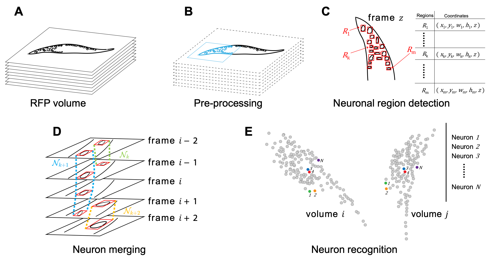

# CeNDeR

Processing pipeline, dataset for “[*Rapid detection and recognition of whole brain activity in a freely behaving Caenorhabditis elegans*](https://arxiv.org/abs/2109.10474)”

#### Top News

**`2022-01-22`**:  We have released our dataset, CenDer PyTorch implementation, human annotation and proofreading MATLAB toolkits.

**`2022-02-15`**:  We have fixed Memory problem for long-term recording inference.

**`2022-08-03`**:  We have released the training and inference method of our neuron recognition model via jupyter notebooks; we moved annotation and human proofreading toolkit into [CeNDeR-annotation](https://github.com/Wenlab/CeNDeR-annotation).

**`2022-08-09`**:  We have released the CeNDeR 2.0 pipeline.

#### Introduction

CeNDeR is a streamlined machine learning approach that rapidly detects and recognizes most head ganglion neurons and their calcium activity during animal movements. After learning from a small number
of human-annotated examples, a GPU machine is able to process each imaging volume - 1024 x 1024 x 18 in voxels - in less than 1 second and achieves an accuracy of 91% in neuronal detection and above 80% in
neuronal tracking over a long video recording.. Our paper website: [https://arxiv.org/abs/2109.10474](https://arxiv.org/abs/2109.10474).



#### Pipeline inference

<details>
<summary> Data and pretrained models preparation </summary>

You can download dataset, pretrained models and CeNDeR system in [OSF](https://osf.io/v2b5n/).

</details>

<details open>
<summary> Inference </summary>

```shell
bash inference.sh
```


You can also view [Jupyter notebook](https://github.com/Wenlab/C.elegans-Neuron-Recognition-Algorithm/blob/master/inference.ipynb) (if you can't open it, please check [Nbviewer](https://nbviewer.org/github/Wenlab/CeNDeR/blob/main/inference.ipynb))

Here we show one volume result:


</details>


<details>
<summary> Segmentated inference </summary>

To improve accuracy, one should tune pre-processing results (e.g., *C. elegans* coordinate system).

1. Pre-processing stage inference

```shell
python inference.py --only-preprocessing --preprocessing-mode 6 --process-stack-root data/dataset/raw --save-preprocess-result-root data/dataset/proofreading
```

2. Using [LABELME](https://github.com/wkentaro/labelme) (version 4.5.7) to tune

```shell
labelme data/dataset/proofreading
```

3. Pipeline inference from modified *C. elegans* coordinate system:

```shell
python inference.py --load-preprocess-result-root data/dataset/proofreading --process-stack-root data/dataset/raw --json-store-root data/dataset_result
```

</details>

<details>
<summary> Model training </summary>

Detection training example:

```shell
python src/detection/det_train.py
```

Recognition training example:

```shell
# CeNDeR dataset
python src/benchmarks/datasets/fDNC.py --mode 0
python src/recognition/training/exps/e1.py
```

You can also view [Jupyter notebook](https://github.com/Wenlab/C.elegans-Neuron-Recognition-Algorithm/blob/master/recognition.ipynb) (if you can't open it, please check [Nbviewer](https://nbviewer.org/github/Wenlab/CeNDeR/blob/main/recognition.ipynb))

```shell
# NeRVE dataset
python src/benchmarks/datasets/fDNC.py --mode 1
python src/benchmarks/datasets/CeNDeR.py --mode 1
python src/recognition/training/exps/e1.py
```

Check [TensorBoard](https://www.tensorflow.org/tensorboard) for training details.

```shell
tensorboard --logdir=tb_log
```

</details>


<details>
<summary> Annotation toolkit </summary>

[The toolkit](https://github.com/Wenlab/CeNDeR-annotation) can view and annotate whole brain imaging data.

</details>

#### Contributors

- [Yuxiang Wu](https://github.com/wuyxiquanquan) (`elephantameler@mail.ustc.edu.cn`)
- [Tianqi Xu](https://github.com/xutq) (`xutq@ustc.edu.cn`)
- [Quan Wen](https://github.com/wenquan) (`qwen@ustc.edu.cn`)

